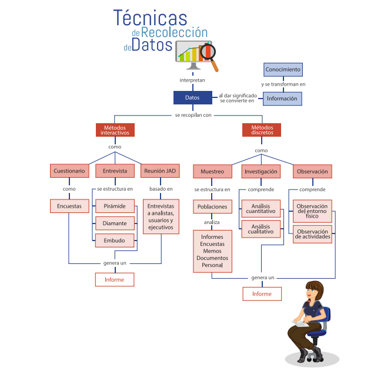

# TÉCNICAS DE RECOLECCIÓN DE DATOS

## INTRODUCCION

La tarea más importante de los analistas de sistemas, es la recolección de datos, y para ello existen muchas y variadas técnicas que le permiten obtener la información desde las fuentes primarias, en este caso es el cliente quien ofrece la información más confiable y real. El analista debe elaborar instrumentos que le permitan obtener información a través de todas las etapas del proyecto de software. 

Para el desarrollo de esta temática, es necesario distinguir claramente la diferencia entre dato, información, conocimiento y una descripción de las características de los datos, para continuar con el estudio de los métodos interactivos de recopilación de información. 

Cada uno de estos métodos poseen procesos propios y permiten garantizar un análisis apropiado de la información, entre ellos se estudian a profundidad: entrevista, cuestionario y talleres JAD (Joint Application Design), lo mismo que se abordarán, para su estudio los métodos discretos entre los cuales se encuentra el muestreo, la investigación y la observación que utilizados en conjunto o separados pueden ofrecer un panorama completo de la organización

## DATOS, INFORMACION Y CONOCIMIENTO.

El uso de los términos, dato, información o conocimientos, es indiscriminado, lo que muchas veces lleva a interpretar su significado de forma distinta, sin embargo, para entender la diferencia que existe entre cada uno de ellos es necesario revisar sus definiciones.

## DEFINICION DE DATO, INFORMACION Y CONOCIMIENTO

Es la mínima unidad semántica que corresponde a los elementos primarios de la información y que por sí solos son irrelevantes en la toma de decisiones. Otras definiciones que se encuentran son las siguientes:

De acuerdo con Gispert (2002) el dato, “Es un conjunto discreto, de factores objetivos sobre un hecho real o bien un registro de transacciones que por sí mismo tiene poca o ninguna relevancia o propósito” .

Y de acuerdo con Diccionario Ilustrado (2000) es “Antecedente o fundamento que permite llegar más fácilmente al conocimiento de una cosa, el cual por sí mismo no tiene relevancia alguna”.

Un dato es un símbolo o símbolos que describen condiciones, hechos, situaciones o valores.

Un dato puede significar un número, una letra, un signo ortográfico o cualquier símbolo que represente una cantidad, una medida, una palabra o una descripción.

Tienen la capacidad de asociarse dentro de un contexto para convertirse en información. Por si mismos los datos no tienen capacidad de comunicar un significado y por tanto no pueden afectar el comportamiento de quien los recibe.

Para que un dato sea útil debe convertirse en información, de tal manera que ofrece un significado, conocimiento, ideas o conclusiones

### TIPOS

* **Cuantitativos:** son aquellos que se pueden contar o medir, ejemplo: edad, peso, fecha de transacción.

* **Cualitativos:** no se pueden contar, ni medir, ejemplo: sexo, descripción de un artículo, nombre.

Los datos contienen dentro de su característica más importante a la integridad; significa que, todos los datos requeridos para responder a una pregunta específica están disponibles. Por ejemplo, un marcador de un partido de futbol, debe incluir el marcador de goles de los dos equipos, si se anuncia el marcador de un solo equipo este será incompleto y no tendría sentido.

Además de que los datos pueden soportar operaciones de almacenamiento, recuperación y reproducción también los datos se pueden procesar.

El procesamiento de los datos corresponde a las acciones sobre cualquier tipo de datos, para luego obtener información oportuna y útil en el logro de un mayor control y mejor toma de decisiones.

Se pueden clasificar una serie de pasos. A continuación se describen los pasos.

* **Entrada:** Registro de datos en un medio adecuado para su manejo y 
procesamiento.

* **Proceso:** Pueden organizarse de diferentes maneras:

    * **Clasificación:** establecer un orden lógico para los datos 
    según uno de sus atributos. Ejemplo: número de cédula, 
    apellido, nivel de ventas, entre otros.

    * **Agrupación:** consiste en separar sistemáticamente los datos 
    por categorías. Ejemplos: tipo de productos, departamentos, 
    rangos, entre otros.

    * **Cálculos:** se refieren a los procesos aritméticos (+, -, * y /) 
    y operaciones lógicas para convertir los datos en una forma 
    significativa.

## INFORMACION

Conjunto de datos que han sido tratados o procesados y que tienen un significado real y concreto para la toma de decisiones dentro de las organizaciones. Se define también como “un mensaje, normalmente bajo la forma de un documento o algún tipo de comunicación audible, gráfica o visible, que tiene un emisor y un receptor; capaz de impactar sobre sus juicios de valor y comportamiento al proporcionar ciertas diferencias en su interior o exterior. “ (Diccionario Ilustrado, 2000).

Es una colección de hechos significativos pertinentes, para una organización. Se puede afirmar que información es un conjunto de datos significativos y pertinentes que describan sucesos o entidades.

La información se clasifica de acuerdo a las siguientes características:

### CARACTERISTICAS

* **Significado** (semántica): ¿Qué quiere decir?

* **Importancia** (relativa al receptor): ¿Trata sobre alguna cuestión importante?

* **Vigencia** (en la dimensión espacio-tiempo): ¿Es actual o desfasada?

* **Validez** (relativa al emisor): ¿El emisor es fiable o puede proporcionar información no válida (falsa)?

* **Valor** (activo intangible volátil): ¿Resulta útil para el destinatario?

Los datos a diferencia de la información son utilizados como diversos métodos para comprimir la información a fin de permitir una transmisión o almacenamiento más eficaz.

La cantidad de información de un mensaje puede ser entendida como el número de símbolos posibles que representan el mensaje.

Los símbolos que representan el mensaje no son más que datos significativos.

La información es un mensaje con un contenido determinado emitido por una persona hacia otra y, como tal, representa un papel primordial en el proceso de la comunicación, a la vez que posee una evidente función social.

A diferencia de los datos, la información tiene significado para quien la recibe, por eso, los seres humanos siempre han tenido la necesidad de cambiar entre sí información que luego transforman en acciones.

La información es, entonces, conocimiento basado en los datos, a los cuales mediante un procesamiento, se les ha dado significado, propósito y utilidad.

## CONOCIMIENTO

Es una mezcla de experiencia, valores, información que sirven como marco para la incorporación de nuevas experiencias.

### CARACTERISTICAS

De acuerdo con lo especificado por (Star, págs. 5-9) la información debe poseer ciertas características para que a los encargados de la toma de decisiones le resulte valiosa.

Para diseñar el plan para obtener la mejor información, se estudiará a continuación cada uno de los métodos de obtenerla y se entregaran pautas para poder elegir el que mejor método que se adecue al proyecto. Para iniciar este trabajo es importante tener claro los conceptos y diferencias que existe entre:

* **Metodo:** Se define como el modo en que se procede y los procedimientos seguidos para hallar la verdad acerca del objeto de investigación.

* **Tecnica:** Conjunto de reglas y procedimientos que permiten al investigador establecer la relación con el objeto o sujeto de la investigación.

* **Herramienta:** Mecanismo que usa el investigador para recolectar y registrar la información: formularios, pruebas, test, escalas de opinión, listas de chequeo.

## METODOS 

Los métodos propuestos por (Kendall, 2011) para la recolección de datos en proyectos de desarrollo de software son dos: métodos interactivos que permiten una interacción directa con el cliente y los usuarios del sistema de información. En este método se propone trabajar con tres herramientas básicas: entrevista, cuestionarios y talleres de trabajo de JAD. Y los métodos discretos que le permiten a los analistas realizar una descripción más clara y completa de los requerimientos para este método, propone observación, investigación y muestreo.

El valor real de la información está directamente relacionado con la utilidad que representa para los usuarios en el cumplimiento de las metas de la organización.

### METODOS INTERACTIVOS

#### ENTREVISTA

Es una conversación dirigida con un propósito específico. Su objetivo es recopilar información.

Este método se aplica cuando se requiere obtener la información de manera directa a través de la aplicación de un cuestionario en un dialogo abierto entre un receptor y emisor, para ello se deben tener en cuenta las siguientes recomendaciones al momento de realizar una entrevista.

#### RECOMENDACIONES:

Recomendaciones para realizar una entrevista:

* Es bueno realizar el ejercicio de la auto entrevista antes de realizar una entrevista.

* Reconocer sus predisposiciones y la forma como puede ser afectado por las percepciones.

* Se debe tener en cuenta que la ética, intelecto, crianza, educación, y emociones pueden afectar lo que se escuchará en la entrevista.

* Elaborar un proceso completo antes de realizar la entrevista.

* Revisar cuidadosamente antes de realizar la entrevista para convertirla en una entrevista de éxito

* Hacer de la entrevista un suceso satisfactorio para el entrevistado.

* Recordar que con la entrevista se va a obtener opiniones del entrevistado.

#### PASOS:

Pasos para preparar una entrevista:

* Antes de elaborar la entrevista se debe buscar información relacionada con la organización, conocer las actividades, la misión, visión, se debe buscar en la web para revisar si tiene una página en dónde se podrá conocer más acerca de ella.

* Completado el primer paso, se fijaran los objetivos de la entrevista. concentrarse en los procesos o áreas objeto de estudio.

* Realizar una lista de las personas a quienes se puede entrevistar, recordar que ellos son la clave para obtener la información de la fuente primaria, ellos conocen el funcionamiento de los procesos y aportan la mayor cantidad de información para el proyecto.

* Antes de realizar la entrevista es necesario que se preparen a los entrevistados, para ello se pueden llamar por teléfono, enviarles un correo electrónico, para que estén preparados, si la entrevista es muy estructurada enviar el cuestionario con anticipación para que esté preparado para las respuestas. 
Recordar que cuando se realiza una entrevista se deben cumplir varios objetivos (crear confianza y observar el sitio de trabajo) por lo tanto no es recomendable que la entrevista se realice por correo.

#### TIPOS DE PREGUNTAS:

Una de las actividades que se debe realizar para preparar una entrevista, es construir las preguntas, estas preguntas pueden ser de dos tipos abiertas y cerradas.

##### PREGUNTAS ABIERTAS:

Las preguntas abiertas se plantean para solicitar opiniones o explicaciones acerca del tema específico de consulta.

* ¿Qué opina acerca del manejo del correo electrónico de su compañía?

* ¿Cuál o cuáles son los problemas más comunes que se presentan en su área de trabajo?

* Explique paso por paso, el proceso que tiene a cargo.

* Enumere quiénes son los responsables y cuáles son las actividades que realiza cada uno.

* ¿Ha considerado otros métodos para mejorar la seguridad de la información?

##### PREGUNTAS CERRADAS:

Las preguntas cerradas limitan las respuestas de los entrevistados. Se encuentran de varios tipos entre ellos se tiene: las de opción múltiple, las bipolares, de escala entre otras.

* ¿Desea recibir un informe mensual de ventas?

* ¿El formulario se encuentra completo?

* ¿Está de acuerdo en recibir la información en formato PDF?

* ¿Le gustaría que los procesos de su empresa se automaticen?

* ¿Está de acuerdo en que la aplicación mantenga un módulo de preguntas y 
respuestas frecuentes?

##### SONDEO:

El sondeo es otro tipo de preguntas que se utiliza para realizar un seguimiento o completar conceptos o ir más allá de la repuesta inicial. Ejemplos de sondeo:

* ¿Por qué? Mencione un ejemplo de cómo funciona el proceso de ventas.
* ¿Cuál sería la solución a su problema? Ilustre cuáles son los problemas que se presentan respecto a la seguridad de los datos.
* ¿Para qué?
* ¿Cómo cree que debería funcionar?

#### SECUENCIA LOGICA

Existen básicamente dos secuencias lógicas para ordenar las preguntas de una entrevista: embudo y pirámide. Existe además una tercera que es la combinación de las dos, llamada estructura de diamante.

##### ESTRUCTURA PIRAMIDE:

Para iniciar la entrevista el entrevistador utiliza preguntas muy detalladas o específicas, generalmente cerradas y a medida que avanza la entrevista las convierte en preguntas generales o abiertas. Como se muestra en la siguiente figura

##### ESTRUCTURA EMBUDO:

Se inicia la entrevista con preguntas generales o abiertas para reducirlas a preguntas cerradas. Esta estructura permite iniciar una entrevista de forma fácil y amigable, un ejemplo de este tipo de estructura se puede observar en la siguiente figura.

##### ESTRUCTURA DIAMANTE:

A menudo es mejor utilizar una combinación de los dos tipos de estructuras, es decir, se comienza con preguntas cerradas o particulares, con abiertas o generales y finalizar con preguntas cerradas como se puede observar en la siguiente figura. El entrevistador comienza con preguntas sencillas y cerradas para entrar en calor, avanza con preguntas generales, temas más amplios y complejos y para finalizar se realizan preguntas restringidas para obtener respuestas específicas del entrevistado.

#### DISEÑO DE APLICACION CONJUNTA METODO (JAD)

A pesar de ser un buen entrevistador, muchas veces es necesario utilizar o cruzar las entrevistas con otros métodos que permitan recoger la información de primera mano. La compañía IBM desarrolló una metodología que permite entrevistar uno a uno los usuarios del sistema, conocida con el nombre de diseño de aplicaciones conjuntas JAD.

Este método puede sustituir en cualquier momento a las entrevistas puesto que le permite como analista de sistemas un mejor análisis de los requerimientos y diseñar la interfaz de usuario del sistema de información en forma conjunta con los usuarios finales de la aplicación, en un ambiente de trabajo de grupo.

##### CONDICIONES:

La siguiente lista ayudará a determinar cuándo utilizar un diseño de aplicación conjunto (Kendall, 2011).

* Los grupos de usuarios estén inquietos y desean algo nuevo, una solución estándar para un problema en común.

* La cultura de la organización apoya los comportamientos de solución de problemas conjuntos entre varios niveles de empleados.

* Los analistas pronostican que la cantidad de ideas generadas mediante la entrevista cara a cara no aporta el número de ideas posibles como un ejercicio extendido.

* El flujo de trabajo permite la ausencia del personal clave durante un periodo de dos (2) a cuatro (4) días.

##### PERSONAL INVOLUCRADO:

Las sesiones de diseño de aplicaciones conjuntas incluyen varios participantes: analistas, diseñadores, usuarios, ejecutivos, entre otros, ver siguiente figura quienes aportan acerca de los antecedentes y capacidades del sistema. Las tareas se disponen de la siguiente manera:

* Metodología (2 miembros).Patrocinador ejecutivo.Un superior que realice la introducción y cierre de la sesión.

* Por lo menos un analista de sistemas quien escuchará acerca de las necesidades de los usuarios. Además, asesora acerca de los costos y evita soluciones irreales y costos desproporcionados.

* De ocho (8) a doce (12) usuarios preferiblemente aquellos que puedan articular la información que se necesita para realizar los trabajos.

* Líder de la sesión quien debe ser excelente comunicador y no necesariamente analista o diseñador de sistemas, preferiblemente un consultor externo.

* La sesión también puede contar con uno (1) o dos (2) observadores que sean expertos en el tema, para ofrecer explicaciones técnicas.

##### PREGUNTAS:

El ambiente en el que se deben desarrollar las reuniones, es recomendable que en lo posible se realicen por fuera de la organización, el ambiente debe ser cómodo, con todas las herramientas (ver figura 8) disponibles, el objetivo es que el grupo de trabajo se distraiga, lo menos posible en sus responsabilidades diarias.

Es importante programar las sesiones cuando todos los involucrados puedan asistir, de lo contrario no se pueden obtener los objetivos propuestos.

Para cada uno de los temas se deben responder y formular las siguientes preguntas:

* ¿Quien?
* ¿Como?
* ¿Cuando?
* ¿Cuando?
* ¿Donde? ¿Por que?

#### CUESTIONARIOS

El uso de cuestionarios permite a los analistas de sistemas estudiar: posturas, creencias, comportamiento, características de un grupo de personas claves dentro de una organización y que se pueden ver afectadas por el sistema actual y propuesto.

Para aplicar los cuestionarios se pueden utilizar herramientas informáticas que facilitan la recolección de la información a través de la red al igual que su análisis.

Igualmente las encuestas permiten: cuantificar lo que se encontró durante las entrevistas, determinar qué tan difundido está el sentimiento expresado durante una entrevista, encuestar a un grupo grande de usuarios, o a un grupo usuarios que están separados geográficamente.

##### VENTAJAS Y DESVENTAJAS

* Ventajas:

    * Ahorro de tiempo. 
    * Desarrollo rápido de entrevistas a usuarios.
    * Ayuda a que los usuarios se involucren más en el desarrollo del sistema debido al entorno dinámico y de lluvia de ideas permiten un diseño más creativo.

* Desventajas:

    * Requiere compromiso de todos los participantes. Los diseños resultan insatisfactorios si la preparación de la reunión y los documentos de especificaciones están incompletos.

    * La sesión puede resultar improductiva si la organización no permite el esfuerzo concertado requerido.

    * Cuando se decide encuestar a un grupo de usuarios, es necesario invertir el tiempo necesario para la elaboración de las preguntas y determinar el tipo información que se desea recolectar.

### METODOS DISCRETOS

#### MUESTREO

Es un proceso que permite seleccionar sistemáticamente elementos representativos de una población.

Algunas de las poblaciones sobre las que el analista puede decidir obtener una muestra son:

* Documentos.
* Personas.

El analista debe seleccionar una muestra representativa de la población para realizar ya sean: observaciones, entrevistas o aplicar encuestas por varias razones:

* Contener costos.
* Agilizar el proceso de recolección de datos.
* Mejorar la efectividad.
* Reducir la predisposición.

##### DETERMINAR LOS DATOS A RECOLECTAR

**Determinar los datos a recolectar o describir:** el analista debe elaborar un plan realista en cuanto a los que debe hacer con los datos después de recolectarlos. En esta etapa el analista debe determinar cuáles son las variables, atributos y elementos de datos asociados a recopilar de la muestra, es importante considerar el objetivo del estudio, lo mismo que el método de recolección.

##### DETERMINAR LA POBLACION

**Determinar la población del muestreo:** la siguiente tarea del analista es determinar la población que intervendrá en el estudio, si son documentos los que se van a analizar en la muestra debe determinar el periodo de tiempo, si por el contrario son personas deben decidir, si incluye uno o varios niveles de la organización, si incluye a los clientes, distribuidores o proveedores.

##### ELEGIR EL TIPO DE MUESTRA

**Elegir el tipo de muestra:** el analista de sistemas puede utilizar uno de los cuatro (4) tipos principales de muestras: conveniencia, intencionada, simple y compleja.

Las de conveniencia son muestras sin restricciones ni probabilidades, se basa en el juicio de un grupo de personas. No es confiable.

##### TIPOS DE MUESTREO

Cuando el analista busca a un grupo de expertos que estén interesados en trabajar en el nuevo sistema de información, está basado en criterios pero no en probabilidades, por lo tanto el tipo de muestra intencionado es confiable solo en un nivel moderado. Cuando se van a elegir personas o documentos para la muestra es necesario elegir un muestreo aleatorio simple, siempre que cada persona o documento tenga la misma probabilidad de ser elegido. Sin embargo no siempre este paso es práctico, sobre todo cuando el muestreo involucra documentos e informes, Las muestras aleatorias complejas más apropiadas para el analista de sistemas se obtienen mediante: el muestreo sistemático, muestreo estratificado y muestreo de conglomerados.

El método sistemático permite entrevistar a la k-ésima persona en una lista de empleados, siempre que la lista no se encuentre ordenada ni este dentro de una periodicidad de tiempo pues existiría una predisposición.

El muestreo estratificado tal vez sea el más importante para el analista, puesto que le permite identificar subpoblaciones o estratos para elegir los elementos o personas que se desean analizar. Este tipo de muestreo le permite al analista recopilar información con eficiencia. Cuando el analista necesita aplicar diferentes métodos para la recolección de datos, también es útil este tipo de muestreo.

El analista debe utilizar el muestreo por conglomerado cuando debe seleccionar un grupo de personas o documentos para estudiarlos a partir de la suposición que son los más comunes para el resto.

##### DECIDIR EL TAMAÑO DE LA MUESTRA

La muestra se debe determinar porque no todos los elementos de la muestra poseen la misma información, si así fuera, sería suficiente un solo elemento para determinar la información requerida.

Para determinar la muestra utilice un número absoluto en lugar de un porcentaje, es posible obtener resultados satisfactorios tomando una muestra de 20 personas para una población de 200 cómo de una de 2’000.000.

Para seleccionar una muestra siga los siguientes pasos:

* Determinar el atributo (Tipo de error a buscar).

* Localizar la base de datos o los informes en los que pueda encontrar el atributo. 

* Examinar el atributo. Estimar, p, proporción de la población que cuenta con el atributo.

* Tomar la decisión subjetiva en relación con la estimación del intervalo aceptable, i.

* Elegir el nivel de confianza y buscar el coeficiente de confianza, z, en una tabla. 

* Calcular, op, el error estándar de la proporción, de la siguiente manera: op = i / z.

* Determinar el tamaño de la muestra necesaria, n, mediante la siguiente fórmula: n = (p(1-p)/op2)+1

#### INVESTIGACION

nvestigar es un proceso que permite descubrir y analizar la información, a partir de diferentes técnicas asociadas a ella:

**Analisis de documentos cuantitativos:** En la empresa existen muchos documentos que permiten realizar un análisis cuantitativo entre ellos se pueden enumerar: informes para toma de decisiones, informes de rendimiento, registros y muchos tipos de formularios, cada uno es utilizado para un fin específico y por un usuario o usuarios determinados.

##### INFORMES

**Informes para toma de decisiones:** Los informes de toma de decisiones permiten a los analistas recopilar información relacionada con diferentes escenarios y usuarios de la empresa, desde estados de inventarios hasta informes sintetizados para la toma de decisiones que permiten observar lo que le permite realizar una investigación minuciosa acerca de la información que se maneja y el nivel de síntesis que se requiere.

**Informes de rendimiento:** Los informes de rendimiento permiten al analista realizar comparaciones de rendimiento actual y esperado, permitiéndole observar si existe un rendimiento adecuado para las áreas claves de la empresa.

##### REGISTROS Y FORMULARIOS

Los registros proveen actualizaciones periódicas de lo que ocurre en la empresa, si el encargado está realizando su labor adecuadamente y en los momentos oportunos. Los registros le proveen al analista:

* Revisión de errores.
* Oportunidades de mejora del diseño de los formularios.
* Tipo de transacciones.
* Simplificar el trabajo del usuario.

Para recolectar información relacionada con los formularios es necesario que un encargado del equipo recopile la información de los formularios en un documento en blanco.

* Recolectar información de todos los formularios en uso.
* Tipo de formulario.
* Patrón de distribución deseado.
* Comparar el patrón de distribución deseado con quiénes recibieron el formulario.

**Analisis de documentos cualitativos:** Entre los documentos cualitativos que el analista debe tener en cuenta para revisar se encuentran.

* Correos electrónicos, correspondencia en general, memorandos, anuncios publicitarios, sitios web corporativos, manuales, manuales de política. Durante este proceso los analistas pueden recuperar información detallada relacionada con las expectativas de los autores y la forma como esperan interactuar con las tecnologías de la información.

* Los lineamientos descritos en la siguiente figura le ayudarán a adoptar un enfoque sistemático para este tipo de análisis, adicionalmente se debe considerar quien envía los mensajes y quién los recibe.

#### OBSERVACION

Con la observación se pueden apreciar detalles del comportamiento humano, de los 
documentos y del entorno físico en general. 
El analista puede comprender lo que se lleva a cabo en la realidad no sólo de lo que se 
encuentra documentado o explicado, le permite ver las relaciones que existen entre los 
que toman las decisiones y los demás miembros de la organización y las interacciones 
con la tecnología.

